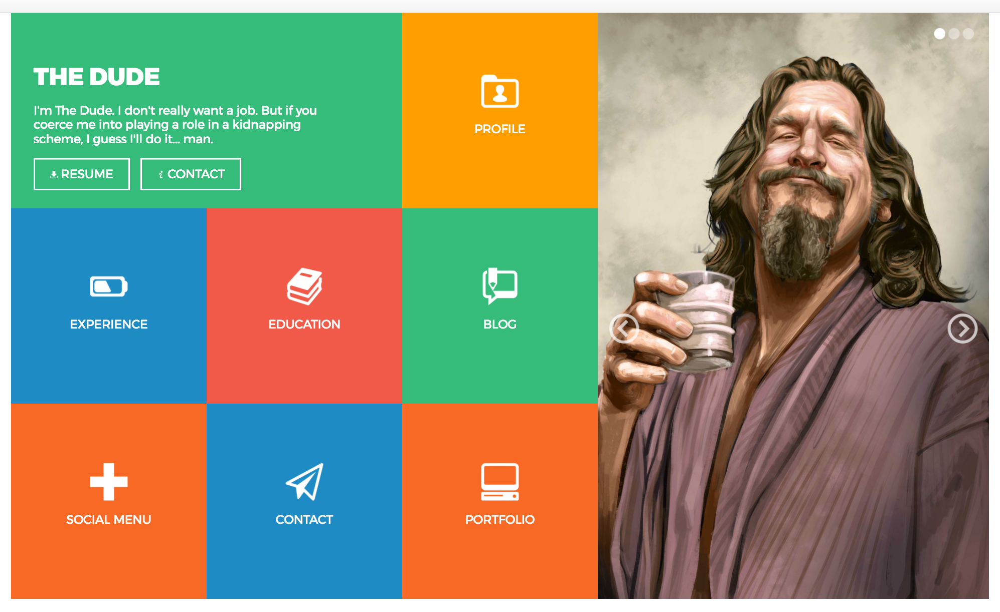

# Static comp 1

the purpose of this project was to create a responsive site that matched the initial comp and scaled down to a 320px mobile site.  Given was the comp at full screen.  Students were given no assets to begin with.  They were asked to use judgement in how to scale down the site to mobile.

## The Example Comp

## My Work

I matched the comp using flexbox in many places.  It was a newly introduced topic in class and we were encouraged to use it.  I set break points at 935px, 800px, 450px, and 400px to achieve this.  The use of sizing elements in flex was critical to my approach.
